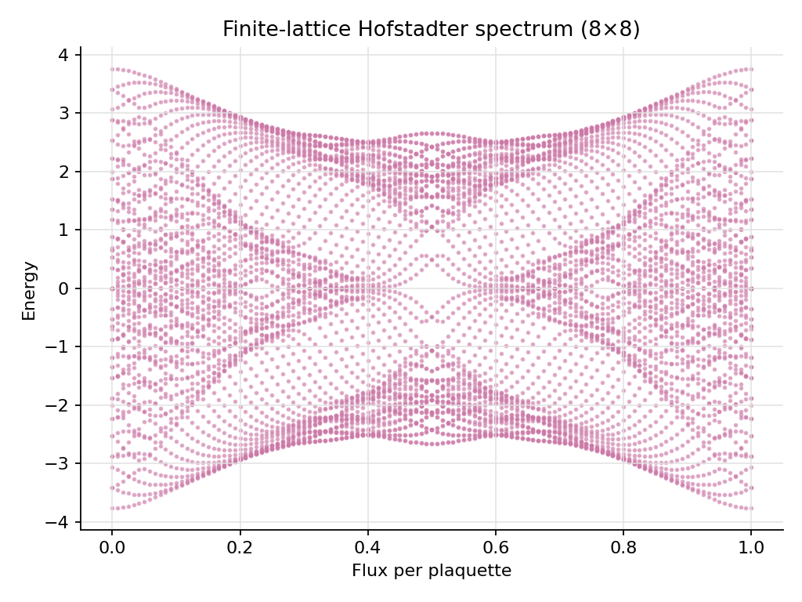

# Quantum Lattice Models

<p align="center">

<a href="https://pypi.org/project/quantum-lattice-models/">

</a>

<a href="https://pypi.org/project/quantum-lattice-models/">

</a>

<a href="https://github.com/SidRichardsQuantum/Quantum_Lattice_Models/actions/workflows/tests.yml">

</a>

<a href="https://sidrichardsquantum.github.io/Quantum_Lattice_Models/">

</a>

<a href="LICENSE">

</a>

<a href="https://github.com/sponsors/SidRichardsQuantum">

</a>

</p>

Quantum Lattice Models is a lightweight, package-first Python library for constructing, analyzing, plotting, and exporting small lattice Hamiltonians used in physics workflows and quantum algorithm research prototypes.

Its core scope is model and lattice data: creation or import, validation,
construction, metadata preservation, and interchange. Lightweight spectra,
observables, entanglement, dynamics, topology, and plotting tools are included
when they help users inspect or validate those models; specialized large-scale
simulation and workflow execution remain the responsibility of external
packages.

PyPI: [https://pypi.org/project/quantum-lattice-models/](https://pypi.org/project/quantum-lattice-models/)

Website: [https://sidrichardsquantum.github.io/Quantum_Lattice_Models/](https://sidrichardsquantum.github.io/Quantum_Lattice_Models/)



This repository is organized as an installable package first.
The real logic lives in `src/quantum_lattice_models/`; notebooks, scripts, and examples should stay thin and import the public package API.
The top-level `quantum_lattice_models` API imports directly from focused modules
such as `spin`, `tight_binding`, `hubbard`, and `topological`.
`quantum_lattice_models.models` remains available as a backwards-compatible
re-export surface.

## Implemented Models

- Transverse-field Ising spin chain
- Longitudinal-field Ising spin chain
- Next-nearest-neighbor Ising spin chain
- Anisotropic Heisenberg spin chain
- XY spin chain
- XXZ spin chain
- Frustrated J1-J2 Heisenberg spin chain
- Two-leg Heisenberg spin ladder
- Truncated Bose-Hubbard chain
- Spinful Fermi-Hubbard chain
- Kitaev-chain Bogoliubov-de Gennes matrix
- Su-Schrieffer-Heeger single-particle tight-binding model
- Rice-Mele single-particle chain
- Generic one-dimensional single-particle tight-binding chain
- Square-lattice single-particle tight-binding model
- Harper-Hofstadter square-lattice model
- Aubry-Andre-Harper quasiperiodic tight-binding chain
- Haldane honeycomb-lattice model
- Triangular-lattice single-particle tight-binding model
- Kagome-lattice single-particle tight-binding model
- User-defined graph/lattice tight-binding models

Spin-chain Hamiltonians are dense qubit-space matrices
Tight-binding Hamiltonians are single-particle matrices.
This distinction is intentional and explicit.
Sparse lattice builders assemble CSR matrices directly; matching dense builders
reuse the same construction path to keep both representations consistent.

Versioned `ModelSpec` and `LatticeSpec` objects provide portable model
parameters and finite-lattice geometry. Specifications can be saved as JSON,
validated in a new process, and rebuilt as dense or sparse Hamiltonians.
`HamiltonianResult` keeps the matrix associated with its model, basis,
representation, and construction metadata without relying on NumPy subclass
attributes.

Model files can be analyzed and exported directly:

```bash
quantum-lattice spectrum ssh.json
quantum-lattice export ssh.json --format npz --output ssh-hamiltonian.npz
```

Models can be filtered and inspected before allocating a matrix:

```bash
quantum-lattice models --category spin --sparse --json
quantum-lattice presets --model ssh_model
quantum-lattice dry-run --preset ssh_topological --n-cells 20 --json
quantum-lattice compare trivial.json topological.json --json
```

Named presets remain ordinary, transparent model specifications:

```python
from quantum_lattice_models import (
    compare_models,
    create_model_from_preset,
    inspect_model,
)

topological = create_model_from_preset("ssh_topological")
trivial = create_model_from_preset("ssh_trivial")
report = inspect_model("transverse_field_ising", n_sites=12)
comparison = compare_models(topological, trivial)
```

NPZ exports are self-contained and preserve metadata for dense and CSR sparse
matrices. NPY exports support dense matrices and write a matching
`.npy.json` metadata sidecar.

External Hamiltonians can be imported without assigning them to a registered
builder:

```bash
quantum-lattice import-matrix external.npy \
  --metadata external-metadata.json \
  --output portable.npz
quantum-lattice inspect portable.npz
quantum-lattice spectrum portable.npz
```

Imported matrices use the explicit `external_matrix` family. They retain their
basis, optional lattice geometry, units, conventions, references, and
provenance, but cannot be reconstructed if the persisted matrix is discarded.

Exports can select a single artifact or create a deterministic directory
bundle:

```bash
quantum-lattice export model.json --artifact model --output exported-model.json
quantum-lattice export model.json --artifact lattice --output lattice.json
quantum-lattice export model.json --artifact metadata --output metadata.json
quantum-lattice export model.json --artifact bundle --output model.bundle
```

A bundle contains `matrix.npz`, `model.json`, `metadata.json`, optional
`lattice.json`, and `manifest.json`. The default `--artifact matrix` behavior
remains unchanged.

Spin models now share a graph-based sparse construction backend. Existing dense
builders retain their return types, while matching sparse builders are
available with a `_sparse` suffix. Arbitrary spin graphs can use
`SpinInteraction`, `SpinField`, and `graph_spin_hamiltonian_sparse`.

Portable specifications for Ising, Heisenberg, XXZ, SSH, and custom
tight-binding models also describe their physical local degrees of freedom,
basis ordering, and onsite or two-body interactions:

```python
from quantum_lattice_models import create_model_spec
from quantum_lattice_models.plotting import plot_interaction_graph

model = create_model_spec(
    "xxz_chain",
    parameters={"n_sites": 4, "coupling": 1.0, "anisotropy": 0.7},
)

print(model.local_degrees)
print(model.basis_mappings)
print(model.interactions)
plot_interaction_graph(model)
```

For spin models, basis mappings identify local tensor-factor order rather than
Hamiltonian row indices. For single-particle models, they identify direct
matrix-basis indices.

The same representation covers truncated Bose-Hubbard factors, spin-resolved
Fermi-Hubbard modes, and Kitaev BdG particle/hole components. Multiple local
modes on one physical site remain distinct and are offset in interaction
diagrams.

Arbitrary spin graphs can be made portable:

```python
from quantum_lattice_models import (
    SpinField,
    SpinInteraction,
    create_graph_spin_spec,
)

model = create_graph_spin_spec(
    3,
    interactions=(
        SpinInteraction(0, 1, "X", "Y", 0.25),
        SpinInteraction(1, 2, "Z", "Z", -0.7),
    ),
    fields=(SpinField(2, "X", 0.4),),
    positions=((0.0, 0.0), (1.0, 0.0), (0.5, 0.8)),
)
H = model.hamiltonian(sparse=True)
```

XXZ and Heisenberg chains with equal $XX$ and $YY$ couplings can also be built
directly in a fixed total Pauli-$Z$ magnetization sector:

```python
from quantum_lattice_models import xxz_chain_sector

sector = xxz_chain_sector(n_sites=12, magnetization=0, anisotropy=0.8)
H = sector.matrix
print(sector.basis.dimension)
```

Spin observables and entanglement routines work with both full and
fixed-magnetization state vectors without requiring reduced states to be
expanded:

```python
from quantum_lattice_models import (
    bipartite_entanglement_entropy,
    site_magnetization_z,
    spin_correlation_matrix,
)
from quantum_lattice_models.spectra import ground_state

_, state = ground_state(H)
magnetization = site_magnetization_z(state, 12, basis=sector.basis)
correlations = spin_correlation_matrix(state, 12, basis=sector.basis, connected=True)
entropy = bipartite_entanglement_entropy(
    state, 12, subsystem=range(6), basis=sector.basis
)
```

## Periodic Unit Cells and Band Topology

Translationally invariant single-particle models use a separate portable
representation whose bonds carry integer cell displacements:

```python
from quantum_lattice_models import (
    ssh_unit_cell,
    standard_momentum_path,
    winding_number,
)
from quantum_lattice_models.plotting import plot_band_structure

model = ssh_unit_cell(t1=0.4, t2=1.2)
path = standard_momentum_path(model)
bands = model.bands(path)
plot_band_structure(bands)
print(winding_number(model))
```

Built-in periodic constructors cover SSH, Rice-Mele, square, honeycomb, kagome,
and Haldane unit cells. Periodic specifications preserve primitive vectors,
orbital positions, displacement-vector bonds, conventions, and provenance in
JSON. They can be expanded into finite `LatticeSpec` supercells.

Equivalent CLI workflows are available:

```bash
quantum-lattice create-periodic ssh --t1 0.4 --t2 1.2 --output ssh-periodic.json
quantum-lattice bands ssh-periodic.json --data-output bands.csv --plot-output bands.png
quantum-lattice topology ssh-periodic.json winding
```

SVG and underlying plot coordinates can be exported independently of
Matplotlib. Topological reference analysis includes Zak phases, chiral winding
numbers, and occupied-subspace Chern numbers.

## Portable Analysis Results

`AnalysisResult` keeps numerical output associated with its source, analysis
parameters, coordinates, solver details, warnings, provenance, and a
declarative plot description:

```python
from quantum_lattice_models import (
    create_model_spec,
    save_analysis_result,
    spectrum_result,
)

model = create_model_spec("tight_binding_chain", parameters={"n_sites": 8})
result = spectrum_result(model.hamiltonian(), model=model)
save_analysis_result(result, "spectrum.npz")
```

Band structures provide `to_analysis_result()`. Dedicated result producers are
also available for Zak phases, winding and Chern numbers, and spin
magnetization or correlation observables. JSON is intended for readable
exchange; NPZ stores numerical arrays compactly without pickles.

Stored records can be inspected, converted, and plotted without rebuilding the
Hamiltonian:

```bash
quantum-lattice spectrum chain.json --result-output spectrum.npz
quantum-lattice inspect-result spectrum.npz
quantum-lattice export-result spectrum.npz --format json --output spectrum.json
quantum-lattice plot-result spectrum.npz --output spectrum.png
```

Analysis records can be included in deterministic Hamiltonian bundles with
repeated `--analysis RESULT` options.

## Advanced Reference Analysis

The package includes structured, small-system reference workflows that return
portable `AnalysisResult` records:

```python
from quantum_lattice_models import (
    berry_curvature,
    evolve_state,
    solve_eigenpairs,
    thermal_observables,
)

solver = solve_eigenpairs(H_sparse, k=4)
dynamics = evolve_state(H_sparse, initial_state, times)
thermal = thermal_observables(H_dense, temperatures)
curvature = berry_curvature(periodic_model, mesh=(31, 31))
```

Sparse eigensolvers report residuals and reject unexpected complete
diagonalization of large sparse matrices. Dynamics supports dense matrix
exponentials and sparse Krylov propagation. Parameter sweeps, finite-size
studies, Wilson loops, reciprocal-space data, and two-parameter heatmaps use the
same result and plotting infrastructure.

Fixed-particle-number Bose-Hubbard sectors reduce the truncated occupation
basis while retaining explicit occupation tuples and embedding support.
Additional observables cover occupations, currents, mixed spin correlations,
total spin, and local density of states.

New benchmark families include Anderson and power-law chains, Creutz and
sawtooth ladders, the flat-band Lieb lattice, XYZ chains, and random-field
Heisenberg chains.

## Why Lattice Models Matter

Small lattice Hamiltonians are useful because they are concrete, inspectable testbeds.
They connect physics intuition to numerical linear algebra, and they give quantum algorithm researchers controlled problems for VQE, QPE, QSVT, spectral transforms, quantum walks, and simulation workflows.

This package does not claim quantum advantage.
It provides honest small-system tools for exact diagonalization, prototyping, teaching, and notebook-first experiments.

## Installation

From a local checkout:

```bash
python -m venv .venv
source .venv/bin/activate
python -m pip install --upgrade pip
python -m pip install -e ".[dev]"
```

Minimal runtime dependencies are `numpy`, `scipy`, and `matplotlib`.

PennyLane export is optional:

```bash
pip install -e ".[pennylane]"
```

Notebook support is optional:

```bash
python -m pip install -e ".[notebooks]"
python -m ipykernel install --user --name quantum-lattice-models --display-name "Quantum Lattice Models"
```

## Quickstart

```python
from quantum_lattice_models.models import transverse_field_ising
from quantum_lattice_models.spectra import ground_energy, spectral_gap

H = transverse_field_ising(n_sites=4, j=1.0, h=0.5, periodic=False)

print(H.shape)
print(ground_energy(H))
print(spectral_gap(H))
```

```python
from quantum_lattice_models.models import ssh_model, ssh_edge_state_localizations
from quantum_lattice_models.spectra import eigensystem

H = ssh_model(n_cells=8, t1=0.5, t2=1.0, periodic=False)
values, vectors = eigensystem(H)
weights = ssh_edge_state_localizations(vectors, n_cells=8, edge_cells=2)
```

## User-Defined Lattices

Users can build custom single-particle tight-binding models without adding a
new function to the package:

```python
from quantum_lattice_models import Lattice, TightBindingModel

lattice = Lattice(
    positions=[(0.0, 0.0), (1.0, 0.0), (0.5, 0.8)],
    bonds=[(0, 1), (1, 2, 0.25j), (2, 0)],
)

H = TightBindingModel(lattice).hamiltonian(hopping=1.0, onsite=[0.0, 0.1, 0.0])
```

Two-item bonds use `-hopping` as the matrix element.
Three-item bonds use the third value directly, which allows complex hoppings
and Peierls phases.

Custom builders can also be registered for discovery in notebooks and the CLI:

```python
from quantum_lattice_models.registry import register_model

register_model(
    "my_model",
    category="user",
    basis="single particle",
    dimension="n_sites",
    return_type="LatticeHamiltonian",
    description="My custom tight-binding model",
    builder=my_builder,
    defaults={"n_sites": 4},
)
```

The plotting helpers can use lattice position metadata directly:

```python
from quantum_lattice_models.plotting import plot_lattice_graph, plot_lattice_state
from quantum_lattice_models.spectra import eigensystem

plot_lattice_graph(H, show_colorbar=True)
values, vectors = eigensystem(H)
plot_lattice_state(H, vectors[:, 0])
```

## Repository Structure

```text
src/quantum_lattice_models/  Package source
tests/                       Pytest test suite
examples/                    Command-line examples that save plots
notebooks/                   Thin-client exploratory notebooks
README.md                    Project overview
CHANGELOG.md                 Release notes
ROADMAP.md                   Planned capabilities and engineering priorities
VALIDATION.md                Scientific reference checks and diagnostics
USAGE.md                     API examples
THEORY.md                    Shared theory, basis, and numerical conventions
docs/models/                 Per-model Markdown references and generated HTML
RESULTS.md                   Generated results
SCHEMA.md                    Portable schema and compatibility policy
IMPORTING.md                 CSV, GraphML, and transformation workflow
```

Future capabilities and their recommended implementation order are documented
in [ROADMAP.md](ROADMAP.md).
Portable fields and compatibility guarantees are documented in
[SCHEMA.md](SCHEMA.md), with import and transformation examples in
[IMPORTING.md](IMPORTING.md).
Implemented analytic checks and the model-validation matrix are documented in
[VALIDATION.md](VALIDATION.md).
Concise equations, variables, examples, and cautions for each model family are
available in the [model reference](docs/models/index.md).

Key package modules:

```text
spin.py                      Dense spin-chain and ladder builders
tight_binding.py             Single-particle tight-binding builders
hubbard.py                   Bose-Hubbard and Fermi-Hubbard builders
topological.py               Haldane, Hofstadter, and Kitaev builders
geometry.py                  Coordinate helpers for plotting
lattice.py                   User-defined lattice containers and custom builders
interchange.py               CSV, NetworkX, and GraphML adapters
transformations.py           Immutable lattice transformations
diagnostics.py               Matrix and pre-build resource diagnostics
comparison.py                Model parameter, matrix, spectrum, and gap comparison
registry.py                  Structured model metadata
specs.py                     Versioned portable model and lattice specifications
storage.py                   Metadata-preserving NPY and NPZ persistence
cli.py                       quantum-lattice command-line entry point
models.py                    Backwards-compatible re-export layer
```

## Notebooks as Thin Clients

Notebooks should import from `quantum_lattice_models` rather than defining their own model logic.
A notebook can choose parameters, run spectra, plot results, and tell a story.
The package should remain the source of truth.

Current notebooks, numbered in the recommended learning order:

- `notebooks/01_ising_spin_chains.ipynb`
- `notebooks/02_spin_observables_and_correlations.ipynb`
- `notebooks/03_spin_chain_model_comparison.ipynb`
- `notebooks/04_heisenberg_ladder_spectrum.ipynb`
- `notebooks/05_hubbard_exact_diagonalization.ipynb`
- `notebooks/06_ssh_rice_mele_comparison.ipynb`
- `notebooks/07_boundary_conditions_and_finite_size.ipynb`
- `notebooks/08_aubry_andre_localization.ipynb`
- `notebooks/09_kitaev_bdg_symmetry.ipynb`
- `notebooks/10_hofstadter_flux_sweep.ipynb`
- `notebooks/11_haldane_kagome_lattices.ipynb`
- `notebooks/12_custom_lattice_workflow.ipynb`
- `notebooks/13_hamiltonian_structure_gallery.ipynb`
- `notebooks/14_sparse_dense_scaling.ipynb`
- `notebooks/15_pennylane_export.ipynb`
- `notebooks/16_model_registry_and_cli.ipynb`
- `notebooks/17_portable_physical_system_records.ipynb`
- `notebooks/18_model_import_export_and_bundles.ipynb`
- `notebooks/19_graph_spin_model_workflow.ipynb`
- `notebooks/20_fixed_magnetization_spin_sectors.ipynb`
- `notebooks/21_lattice_import_and_transformations.ipynb`

## Development

Use the virtual environment for examples, notebooks, tests, and packaging commands.
The standard local checks are:

```bash
make format
make lint
make test
```

The `Makefile` runs Black one file at a time to avoid multi-file formatter stalls observed in some Codespace environments.
Before a release, also run Ruff across the full repository so notebook code
cells are checked:

```bash
python -m ruff check .
python -m pytest -q
```

Install `.[pennylane]` before the test command to exercise the optional
PennyLane export test instead of skipping it.

### Publishing a release

Pushing a tag such as `v0.1.3` runs
`.github/workflows/publish.yml`. The workflow verifies that the tag matches the
version in `pyproject.toml`, runs the release checks, builds the wheel and source
distribution, and publishes them to PyPI.

Configure a PyPI Trusted Publisher for this repository before pushing the first
release tag:

- Owner: `SidRichardsQuantum`
- Repository: `Quantum_Lattice_Models`
- Workflow filename: `publish.yml`
- Environment name: `pypi`

No PyPI API token is required. The GitHub `pypi` environment can optionally
require manual approval before publication.

## Limitations / Truth Contract

- Dense spin-chain matrices have dimension $2^{N}\times2^{N}$ for $N$ sites.
- These tools are for small systems, education, exact diagonalization, and research prototypes.
- SSH, Rice-Mele, square, Harper-Hofstadter, Haldane, triangular, kagome, and generic tight-binding builders return single-particle matrices, not many-body Fock-space Hamiltonians.
- The Bose-Hubbard builder uses a truncated local occupation basis.
- The Fermi-Hubbard builder uses a dense occupation-number basis with explicit fermionic signs.
- The Kitaev-chain builder returns a Bogoliubov-de Gennes matrix, not a many-body Hamiltonian.
- Sparse builders are available for selected tight-binding and Hubbard chains, but exact diagonalization remains a small-system workflow.
- PennyLane is optional and only used when explicitly installed.
- The project is a backend for experiments, not a benchmark suite proving speedup or quantum advantage.

---

## Support development

If this repository is useful for research, learning, or experimentation, you can support continued development via GitHub Sponsors:

https://github.com/sponsors/SidRichardsQuantum

Sponsorship helps support ongoing work on open-source implementations of quantum algorithms, including improvements to documentation, reproducible workflows, and example notebooks.

Support helps maintain and expand practical tooling for variational quantum methods, quantum simulation workflows, and related experimentation.

## Citation

Sid Richards (2026)

Unified Variational and Phase-Estimation Quantum Simulation Suite

## Author

Sid Richards

- LinkedIn: [sid-richards-21374b30b](https://www.linkedin.com/in/sid-richards-21374b30b/)
- GitHub: [SidRichardsQuantum](https://github.com/SidRichardsQuantum)

## License

MIT. See [LICENSE](LICENSE).
