# Results

Generated figures are saved under `images/` by command-line examples.

## Spin Chains

```text
Command: python examples/ising_spectrum.py
Model: Transverse-field Ising
Parameters: n_sites=5, j=1.0, h=0.7, periodic=False
Output: images/ising_spectrum.png
Observation: The dense qubit-space spectrum gives an exact small-system reference.
```

```text
Command: python examples/heisenberg_density.py
Model: Heisenberg chain
Parameters: n_sites=5, jx=1.0, jy=1.0, jz=1.0, field=0.2
Output: images/heisenberg_density.png
Observation: The density-of-states histogram summarizes the finite spin-chain spectrum.
```

## One-Dimensional Single-Particle Lattices

```text
Command: python examples/ssh_edge_state.py
Model: SSH
Parameters: n_cells=12, t1=0.4, t2=1.0, periodic=False
Output: images/ssh_edge_state.png
Observation: The lowest-energy single-particle eigenstate has large probability weight near the chain boundaries.
```

```text
Command: python examples/tight_binding_spectrum.py
Model: Tight-binding chain
Parameters: n_sites=16, hopping=1.0, onsite=0.0, periodic=False
Output: images/tight_binding_spectrum.png
Observation: The finite open-chain spectrum is symmetric around zero for zero onsite potential.
```

```text
Command: python examples/rice_mele_spectrum.py
Model: Rice-Mele
Parameters: n_cells=12, hopping=1.0, dimerization=0.35, staggering=0.4
Output: images/rice_mele_spectrum.png
Observation: Dimerization and staggering open gaps in the finite-chain spectrum.
```

## Interacting and Topological Lattices

```text
Command: python examples/bose_hubbard_spectrum.py
Model: Truncated Bose-Hubbard chain
Parameters: n_sites=3, hopping=0.6, interaction=1.5, chemical_potential=0.2, max_occupancy=2
Output: images/bose_hubbard_spectrum.png
Observation: The spectrum is computed in a truncated occupation basis and remains suitable only for small systems.
```

```text
Command: python examples/hofstadter_butterfly.py
Model: Harper-Hofstadter square lattice
Parameters: n_rows=4, n_cols=4, flux in [0, 1]
Output: images/hofstadter_butterfly.png
Observation: Sweeping magnetic flux reveals the finite-lattice Hofstadter spectrum.
```

```text
Command: python examples/haldane_spectrum.py
Model: Haldane honeycomb lattice
Parameters: n_rows=3, n_cols=3, t1=1.0, t2=0.18, phi=pi/2, sublattice_potential=0.1
Output: images/haldane_spectrum.png
Observation: Complex next-nearest-neighbor hoppings modify the finite honeycomb spectrum.
```

```text
Command: python examples/kagome_graph.py
Model: Kagome tight-binding lattice
Parameters: n_rows=2, n_cols=3, hopping=1.0
Output: images/kagome_graph.png
Observation: The graph plot visualizes the finite kagome connectivity used by the matrix builder.
```

## Executed Notebook Results

The outputs below were captured from the executed notebooks in `notebooks/`. Rendered HTML notebooks are available in `docs/notebooks/`, and generated figures are embedded from `docs/notebook_outputs/` for the GitHub Pages site.

### Ising Spin Chains
- Notebook: `notebooks/ising_spin_chains.ipynb`
- Rendered HTML: [`docs/notebooks/ising_spin_chains.html`](docs/notebooks/ising_spin_chains.html)

```text
model        | shape    | ground energy | spectral gap
---          | ---      | ---           | ---
TFIM         | (32, 32) | -4.971328    |  0.183511
Longitudinal | (32, 32) | -5.749750    |  1.608582
NNN Ising    | (32, 32) | -5.752421    |  0.070473
```

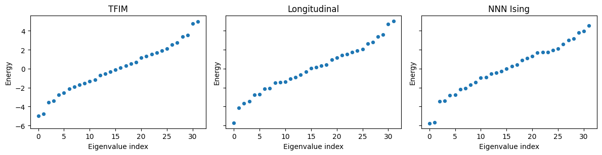


### SSH and Rice-Mele Comparison
- Notebook: `notebooks/ssh_rice_mele_comparison.ipynb`
- Rendered HTML: [`docs/notebooks/ssh_rice_mele_comparison.html`](docs/notebooks/ssh_rice_mele_comparison.html)

```text
model      | shape    | key parameters
---        | ---      | ---
SSH        | (24, 24) | t1=0.35, t2=1.00, periodic=False
Rice-Mele  | (24, 24) | hopping=1.00, dimerization=0.35, staggering=0.40

SSH near-zero states
state | energy | edge weight
---   | ---    | ---
   12 |  2.965266e-06 | 0.984994
   11 | -2.965266e-06 | 0.984994
```

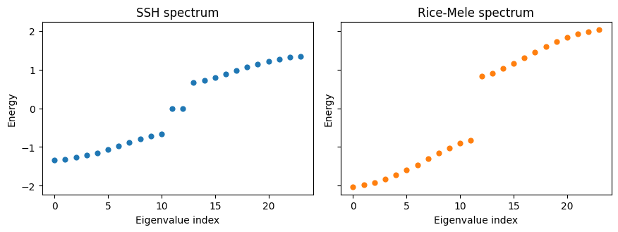

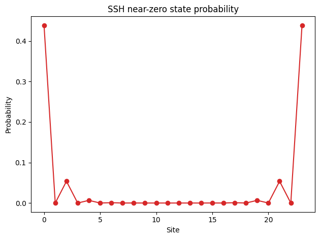


### Hofstadter Flux Sweep
- Notebook: `notebooks/hofstadter_flux_sweep.ipynb`
- Rendered HTML: [`docs/notebooks/hofstadter_flux_sweep.html`](docs/notebooks/hofstadter_flux_sweep.html)

```text
Harper-Hofstadter model
  matrix shape: (16, 16)
  lattice:      4 x 4
  hopping:      1.00
  flux:         0.25
```

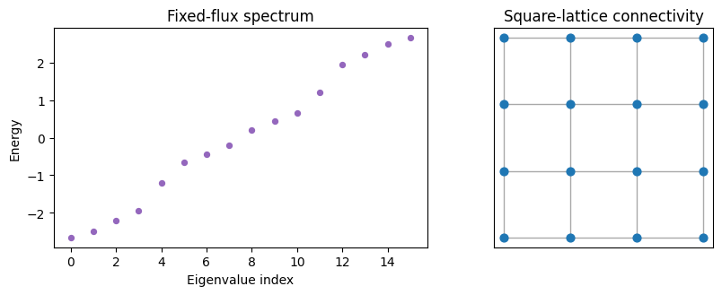

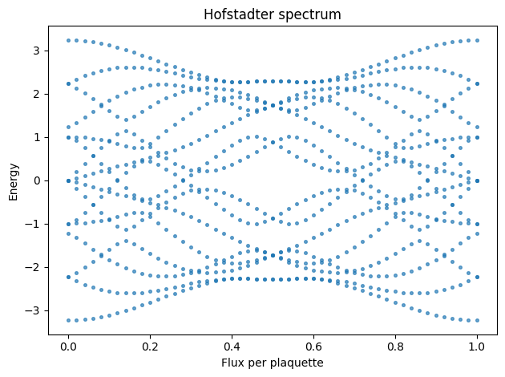


### Hubbard Exact Diagonalization
- Notebook: `notebooks/hubbard_exact_diagonalization.ipynb`
- Rendered HTML: [`docs/notebooks/hubbard_exact_diagonalization.html`](docs/notebooks/hubbard_exact_diagonalization.html)

```text
model          | dense shape | sparse shape | nonzeros
---            | ---         | ---          | ---
Bose-Hubbard   | (27, 27)    | (27, 27)     | 74
Fermi-Hubbard  | (64, 64)    | (64, 64)     | 165

Low-energy summary
  Bose lowest eigenvalues: [-1.902584, -1.714909, -1.33033 , -1.048528]
  Fermi ground energy:     -0.923637
  Ground-state norm:        1.000000
```

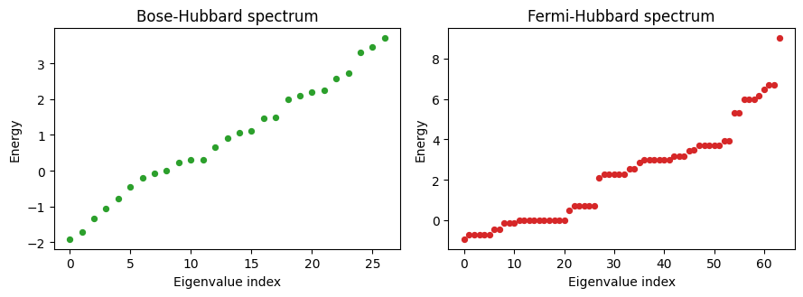


### Haldane, Triangular, and Kagome Lattices
- Notebook: `notebooks/haldane_kagome_lattices.ipynb`
- Rendered HTML: [`docs/notebooks/haldane_kagome_lattices.html`](docs/notebooks/haldane_kagome_lattices.html)

```text
label      | builder                         | shape    | parameters
---        | ---                             | ---      | ---
Haldane    | haldane_honeycomb_lattice       | (18, 18) | t1=1.00, t2=0.18, phi=pi/2, M=0.10
Triangular | triangular_lattice_tight_binding | (9, 9)   | hopping=1.00
Kagome     | kagome_lattice_tight_binding    | (18, 18) | hopping=1.00
```

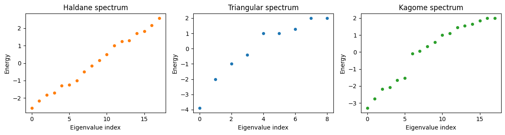

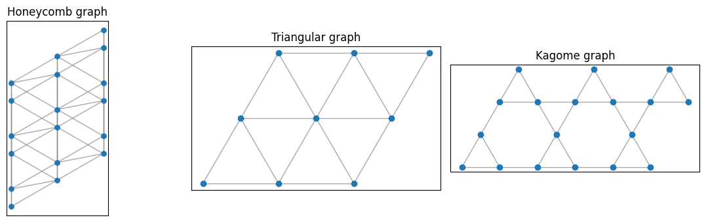


### Model Registry and CLI
- Notebook: `notebooks/model_registry_and_cli.ipynb`
- Rendered HTML: [`docs/notebooks/model_registry_and_cli.html`](docs/notebooks/model_registry_and_cli.html)

```text
Registered models
category      | model
---           | ---
tight_binding | aubry_andre_harper_chain
hubbard       | bose_hubbard_chain
hubbard       | bose_hubbard_chain_sparse
hubbard       | fermi_hubbard_chain
hubbard       | fermi_hubbard_chain_sparse
topological   | haldane_honeycomb_lattice
topological   | haldane_honeycomb_lattice_sparse
topological   | harper_hofstadter_square_lattice
topological   | harper_hofstadter_square_lattice_sparse
spin          | heisenberg_chain
spin          | heisenberg_ladder
spin          | j1_j2_heisenberg_chain
tight_binding | kagome_lattice_tight_binding
tight_binding | kagome_lattice_tight_binding_sparse
topological   | kitaev_chain_bdg
spin          | longitudinal_field_ising
spin          | next_nearest_neighbor_ising
tight_binding | rice_mele_model
tight_binding | square_lattice_tight_binding
tight_binding | square_lattice_tight_binding_sparse
tight_binding | ssh_model
tight_binding | tight_binding_chain
tight_binding | tight_binding_chain_sparse
spin          | transverse_field_ising
tight_binding | triangular_lattice_tight_binding
tight_binding | triangular_lattice_tight_binding_sparse
spin          | xxz_chain
spin          | xy_chain

SSH model metadata
  basis:       single particle
  dimension:   2*n_cells
  return type: LatticeHamiltonian
  defaults:    {'n_cells': 8, 't1': 0.5, 't2': 1.0}

name | category | basis | dimension | return_type
--- | --- | --- | --- | ---
transverse_field_ising | spin | qubit | 2**n_sites | DenseHamiltonian
longitudinal_field_ising | spin | qubit | 2**n_sites | DenseHamiltonian
next_nearest_neighbor_ising | spin | qubit | 2**n_sites | DenseHamiltonian
heisenberg_chain | spin | qubit | 2**n_sites | DenseHamiltonian
xy_chain | spin | qubit | 2**n_sites | DenseHamiltonian
xxz_chain | spin | qubit | 2**n_sites | DenseHamiltonian
j1_j2_heisenberg_chain | spin | qubit | 2**n_sites | DenseHamiltonian
heisenberg_ladder | spin | qubit | 2**(2*n_rungs) | DenseHamiltonian
bose_hubbard_chain | hubbard | truncated boson occupation | (max_occupancy+1)**n_sites | LatticeHamiltonian
bose_hubbard_chain_sparse | hubbard | truncated boson occupation | (max_occupancy+1)**n_sites | scipy.sparse.csr_matrix
fermi_hubbard_chain | hubbard | spinful fermion occupation | 2**(2*n_sites) | LatticeHamiltonian
fermi_hubbard_chain_sparse | hubbard | spinful fermion occupation | 2**(2*n_sites) | scipy.sparse.csr_matrix
ssh_model | tight_binding | single particle | 2*n_cells | LatticeHamiltonian
rice_mele_model | tight_binding | single particle | 2*n_cells | LatticeHamiltonian
tight_binding_chain | tight_binding | single particle | n_sites | LatticeHamiltonian
tight_binding_chain_sparse | tight_binding | single particle | n_sites | scipy.sparse.csr_matrix
square_lattice_tight_binding | tight_binding | single particle | n_rows*n_cols | LatticeHamiltonian
square_lattice_tight_binding_sparse | tight_binding | single particle | n_rows*n_cols | scipy.sparse.csr_matrix
aubry_andre_harper_chain | tight_binding | single particle | n_sites | LatticeHamiltonian
triangular_lattice_tight_binding | tight_binding | single particle | n_rows*n_cols | LatticeHamiltonian
triangular_lattice_tight_binding_sparse | tight_binding | single particle | n_rows*n_cols | scipy.sparse.csr_matrix
kagome_lattice_tight_binding | tight_binding | single particle | 3*n_rows*n_cols | LatticeHamiltonian
kagome_lattice_tight_binding_sparse | tight_binding | single particle | 3*n_rows*n_cols | scipy.sparse.csr_matrix
harper_hofstadter_square_lattice | topological | single particle | n_rows*n_cols | LatticeHamiltonian
harper_hofstadter_square_lattice_sparse | topological | single particle | n_rows*n_cols | scipy.sparse.csr_matrix
kitaev_chain_bdg | topological | Nambu single particle | 2*n_sites | LatticeHamiltonian
haldane_honeycomb_lattice | topological | single particle | 2*n_rows*n_cols | LatticeHamiltonian
haldane_honeycomb_lattice_sparse | topological | single particle | 2*n_rows*n_cols | scipy.sparse.csr_matrix
```

### Kitaev BdG Symmetry
- Notebook: `notebooks/kitaev_bdg_symmetry.ipynb`
- Rendered HTML: [`docs/notebooks/kitaev_bdg_symmetry.html`](docs/notebooks/kitaev_bdg_symmetry.html)

```text
Kitaev BdG summary
  matrix shape:              (24, 24)
  hopping t:                 1.00
  chemical potential mu:     0.40
  pairing Delta:             0.60
  particle-hole symmetric:   True
  smallest absolute energy:  3.593732e-04
```

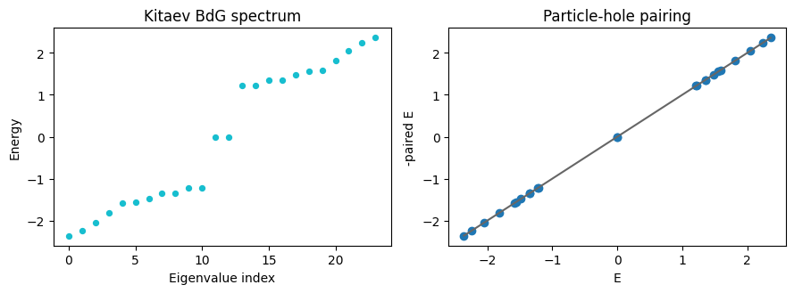


### Heisenberg Ladder Spectrum
- Notebook: `notebooks/heisenberg_ladder_spectrum.ipynb`
- Rendered HTML: [`docs/notebooks/heisenberg_ladder_spectrum.html`](docs/notebooks/heisenberg_ladder_spectrum.html)

```text
Heisenberg ladder summary
  matrix shape:  (64, 64)
  spin sites:    6
  ground energy: -10.811242
  spectral gap:   2.236184
```

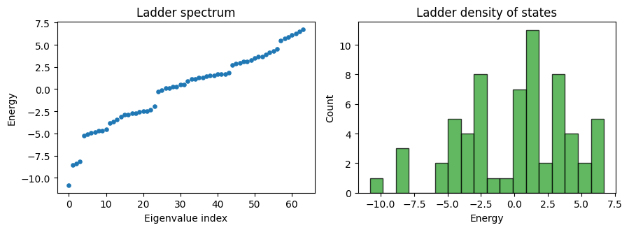


### Sparse and Dense Scaling
- Notebook: `notebooks/sparse_dense_scaling.ipynb`
- Rendered HTML: [`docs/notebooks/sparse_dense_scaling.html`](docs/notebooks/sparse_dense_scaling.html)

```text
model          | dimension | nonzeros | sparse density
---            | ---       | ---      | ---
Bose n=2       |         9 |       13 | 0.1605
Bose n=3       |        27 |       67 | 0.0919
Bose n=4       |        81 |      281 | 0.0428
Fermi n=2      |        16 |       23 | 0.0898
Fermi n=3      |        64 |      165 | 0.0403
Square 4x4     |        16 |       48 | 0.1875
Square 6x6     |        36 |      120 | 0.0926

Square 3x3 lowest eigenvalues
  dense:  [-2.828427e+00, -1.414214e+00, -1.414214e+00, -1.737460e-16]
  sparse: [-2.828427e+00, -1.414214e+00, -1.414214e+00, -1.906322e-18]
```

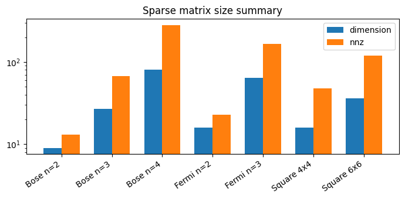


### CLI Plot Walkthrough
- Notebook: `notebooks/cli_plot_walkthrough.ipynb`
- Rendered HTML: [`docs/notebooks/cli_plot_walkthrough.html`](docs/notebooks/cli_plot_walkthrough.html)

```text
First registry lines:
aubry_andre_harper_chain	tight_binding	n_sites	Aubry-Andre-Harper quasiperiodic chain
bose_hubbard_chain	hubbard	(max_occupancy+1)**n_sites	Truncated Bose-Hubbard chain
bose_hubbard_chain_sparse	hubbard	(max_occupancy+1)**n_sites	Sparse truncated Bose-Hubbard chain
fermi_hubbard_chain	hubbard	2**(2*n_sites)	Spinful Fermi-Hubbard chain
fermi_hubbard_chain_sparse	hubbard	2**(2*n_sites)	Sparse spinful Fermi-Hubbard chain
haldane_honeycomb_lattice	topological	2*n_rows*n_cols	Finite Haldane honeycomb lattice
haldane_honeycomb_lattice_sparse	topological	2*n_rows*n_cols	Sparse finite Haldane honeycomb lattice
harper_hofstadter_square_lattice	topological	n_rows*n_cols	Harper-Hofstadter square lattice

SSH spectrum from CLI
index | energy
--- | ---
    0 | -1.413419
    1 | -1.166123
    2 | -0.800098
    3 | -0.047394
    4 |  0.047394
    5 |  0.800098
    6 |  1.166123
    7 |  1.413419

results/notebooks/cli_hofstadter_spectrum.png
exists: True
```
