# Results

Generated figures are saved under `images/` by command-line examples.

## Spin Chains

```text
Command: python examples/ising_spectrum.py
Model: Transverse-field Ising
Parameters: n_sites=5, j=1.0, h=0.7, periodic=False
Output: images/ising_spectrum.png
Observation: The dense qubit-space spectrum gives an exact small-system reference.
```

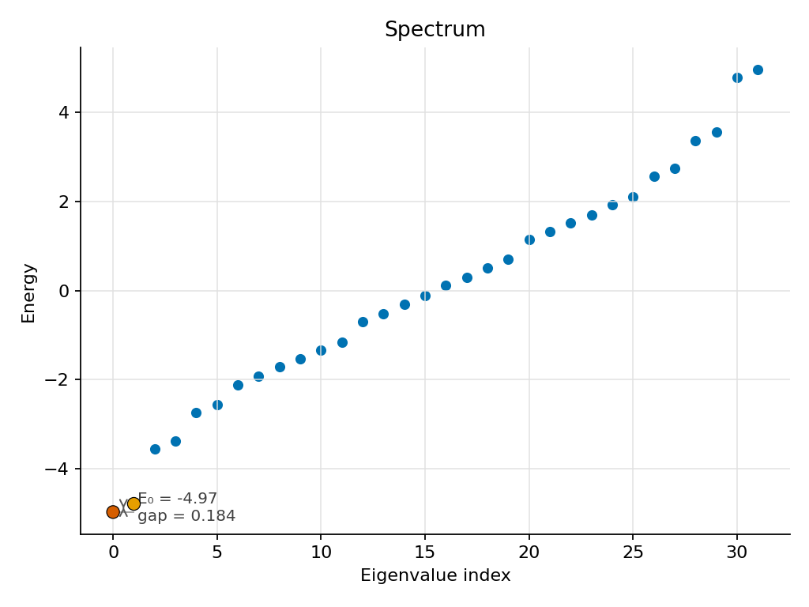

```text
Command: python examples/heisenberg_density.py
Model: Heisenberg chain
Parameters: n_sites=5, jx=1.0, jy=1.0, jz=1.0, field=0.2
Output: images/heisenberg_density.png
Observation: The density-of-states histogram summarizes the finite spin-chain spectrum.
```

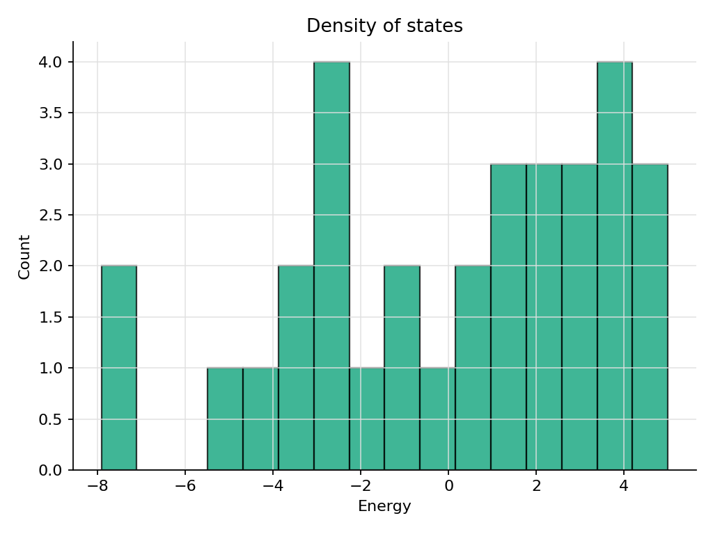

## One-Dimensional Single-Particle Lattices

```text
Command: python examples/ssh_edge_state.py
Model: SSH
Parameters: n_cells=12, t1=0.4, t2=1.0, periodic=False
Output: images/ssh_edge_state.png
Observation: The lowest-energy single-particle eigenstate has large probability weight near the chain boundaries.
```

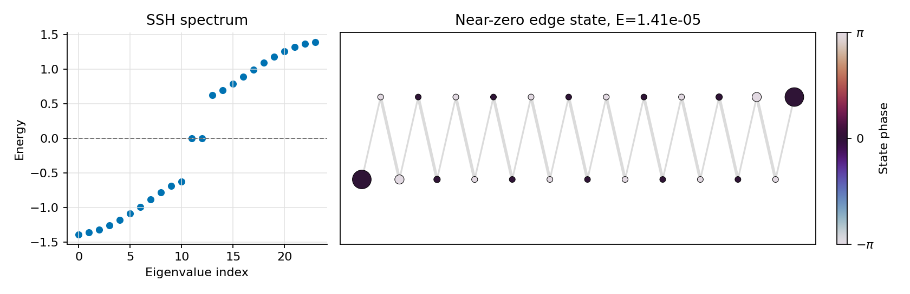

```text
Command: python examples/tight_binding_spectrum.py
Model: Tight-binding chain
Parameters: n_sites=16, hopping=1.0, onsite=0.0, periodic=False
Output: images/tight_binding_spectrum.png
Observation: The finite open-chain spectrum is symmetric around zero for zero onsite potential.
```

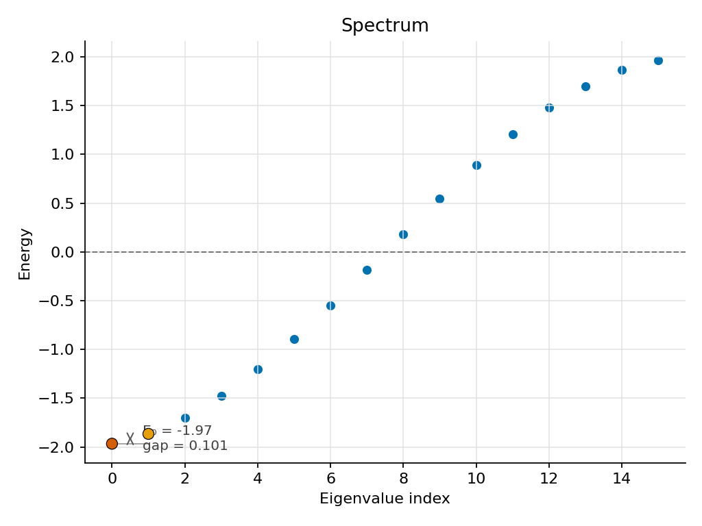

```text
Command: python examples/rice_mele_spectrum.py
Model: Rice-Mele
Parameters: n_cells=12, hopping=1.0, dimerization=0.35, staggering=0.4
Output: images/rice_mele_spectrum.png
Observation: Dimerization and staggering open gaps in the finite-chain spectrum.
```

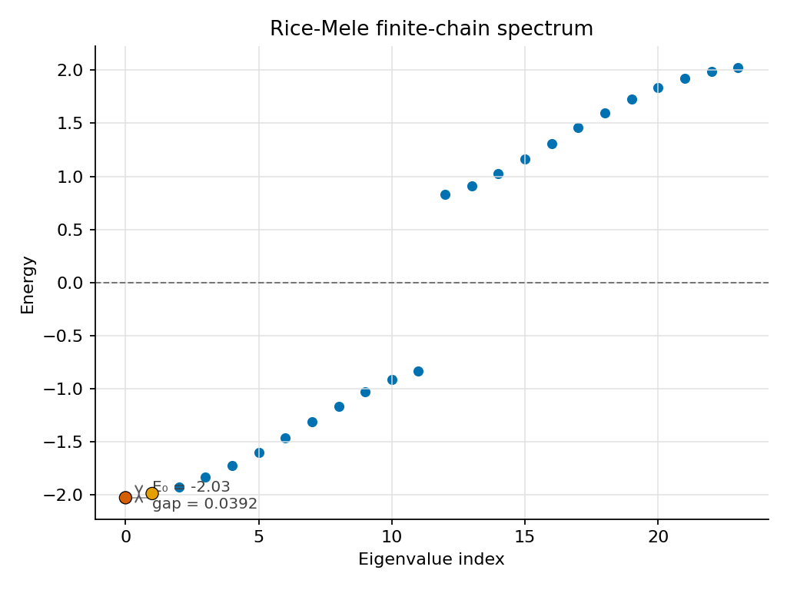

## Interacting and Topological Lattices

```text
Command: python examples/bose_hubbard_spectrum.py
Model: Truncated Bose-Hubbard chain
Parameters: n_sites=3, hopping=0.6, interaction=1.5, chemical_potential=0.2, max_occupancy=2
Output: images/bose_hubbard_spectrum.png
Observation: The spectrum is computed in a truncated occupation basis and remains suitable only for small systems.
```

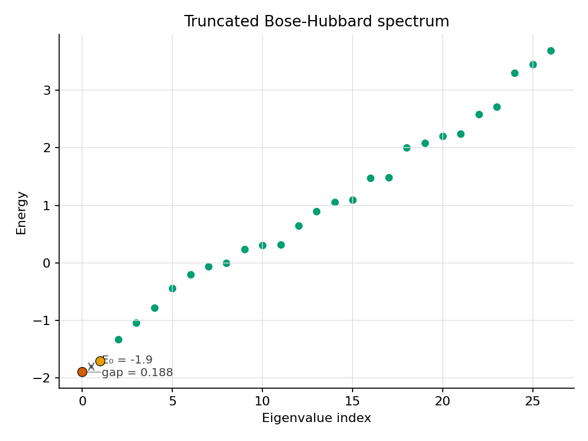

```text
Command: python examples/hofstadter_butterfly.py
Model: Harper-Hofstadter square lattice
Parameters: n_rows=8, n_cols=8, 121 flux values in [0, 1]
Output: images/hofstadter_butterfly.png
Observation: The denser sweep resolves the finite-lattice Hofstadter structure while retaining an explicit finite-size label.
```


```text
Command: python examples/haldane_spectrum.py
Model: Haldane honeycomb lattice
Parameters: n_rows=3, n_cols=3, t1=1.0, t2=0.18, phi=pi/2, sublattice_potential=0.1
Output: images/haldane_spectrum.png
Observation: Complex next-nearest-neighbor hoppings modify the finite honeycomb spectrum.
```

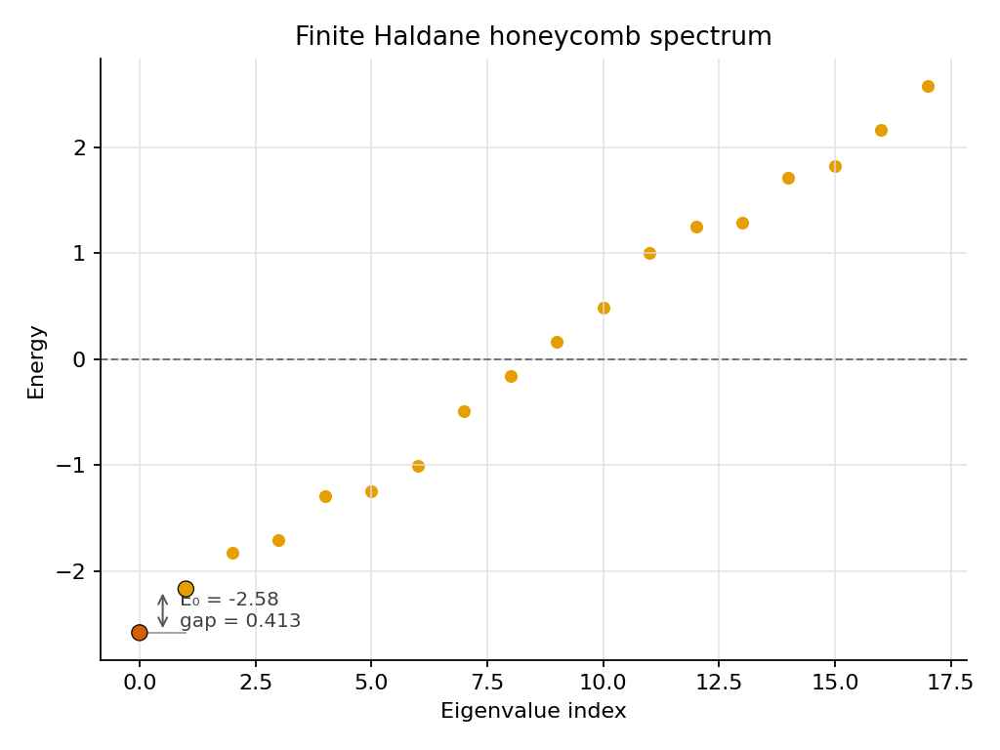

```text
Command: python examples/kagome_graph.py
Model: Kagome tight-binding lattice
Parameters: n_rows=2, n_cols=3, hopping=1.0
Output: images/kagome_graph.png
Observation: The graph plot visualizes the finite kagome connectivity used by the matrix builder.
```

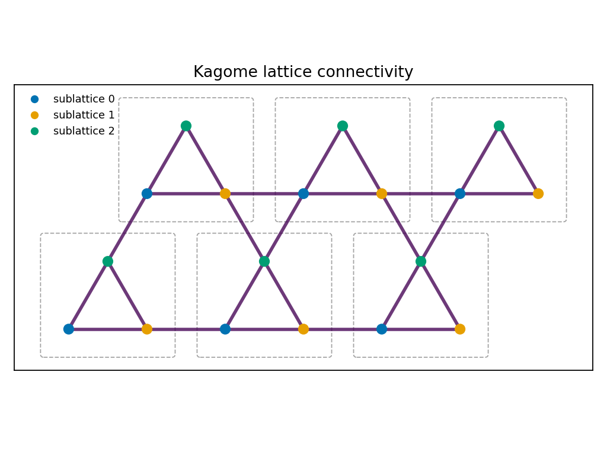

```text
Command: python examples/hamiltonian_matrix.py
Model: Haldane honeycomb lattice
Parameters: n_rows=2, n_cols=3, t1=1.0, t2=0.18, phi=pi/2, sublattice_potential=0.1
Output: images/hamiltonian_matrix.png
Observation: Magnitude exposes matrix sparsity and coupling strength; phase exposes the complex hopping convention.
```

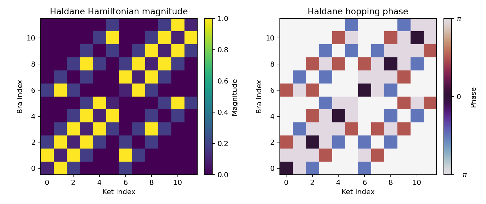

## Executed Notebook Results

The ordered notebook curriculum below was executed from `notebooks/` and
exported to `docs/notebooks/`. Generated figures are stored in
`docs/notebook_outputs/`.

### 01. Ising Spin Chains

- Notebook: `notebooks/01_ising_spin_chains.ipynb`
- [Rendered HTML](docs/notebooks/01_ising_spin_chains.html)
- Result: compares TFIM, longitudinal-field, and next-nearest-neighbor Ising spectra.

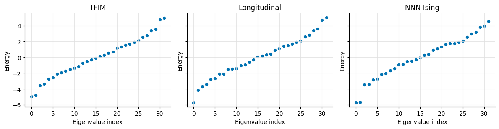

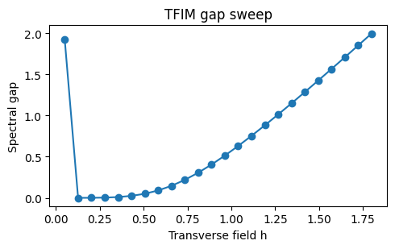

### 02. Spin Observables and Correlations

- Notebook: `notebooks/02_spin_observables_and_correlations.ipynb`
- [Rendered HTML](docs/notebooks/02_spin_observables_and_correlations.html)
- Result: a six-site TFIM sweep with a small $h_z=10^{-3}$ branch-selecting
  field gives a minimum finite-size gap of $0.011813$.

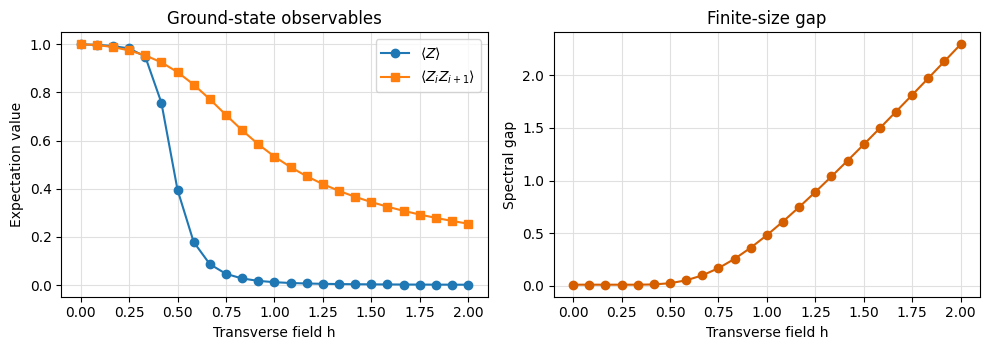

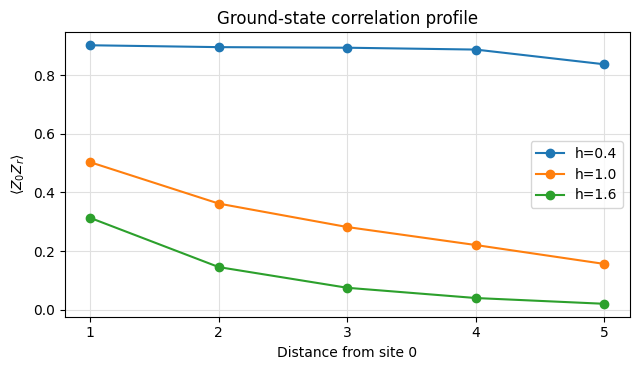

### 03. XY, XXZ, and J1-J2 Spin Chains

- Notebook: `notebooks/03_spin_chain_model_comparison.ipynb`
- [Rendered HTML](docs/notebooks/03_spin_chain_model_comparison.html)
- Result: compares representative spectra and finite-chain gap responses to anisotropy and frustration.

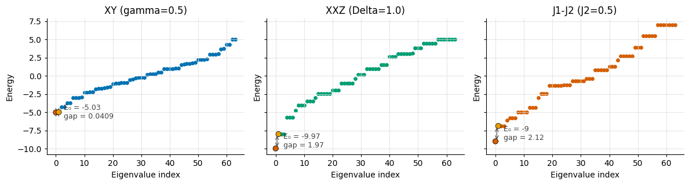

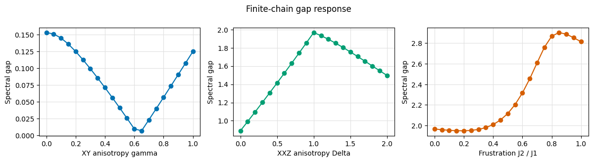

### 04. Heisenberg Ladder Spectrum

- Notebook: `notebooks/04_heisenberg_ladder_spectrum.ipynb`
- [Rendered HTML](docs/notebooks/04_heisenberg_ladder_spectrum.html)
- Result: the six-spin ladder has ground energy $-10.811242$ and spectral gap
  $2.236184$ for the selected parameters.

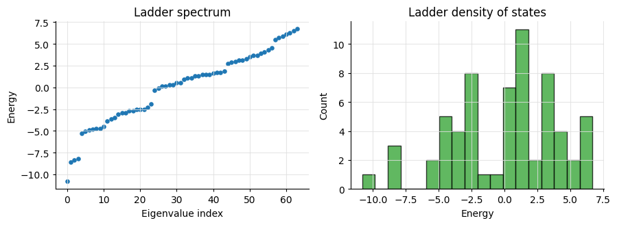

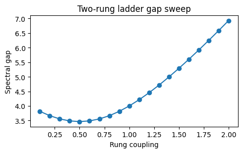

### 05. Hubbard Exact Diagonalization

- Notebook: `notebooks/05_hubbard_exact_diagonalization.ipynb`
- [Rendered HTML](docs/notebooks/05_hubbard_exact_diagonalization.html)
- Result: dense and sparse Bose/Fermi-Hubbard builders agree for the demonstrated small systems.

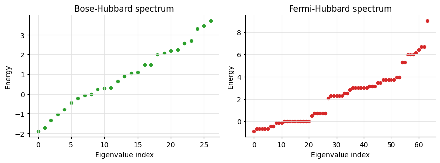

### 06. SSH and Rice-Mele Comparison

- Notebook: `notebooks/06_ssh_rice_mele_comparison.ipynb`
- [Rendered HTML](docs/notebooks/06_ssh_rice_mele_comparison.html)
- Result: the selected open SSH chain has two near-zero states with edge weight
  $0.984994$.

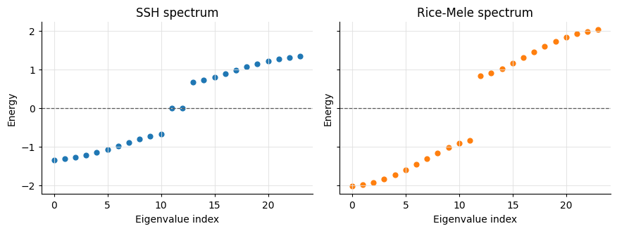

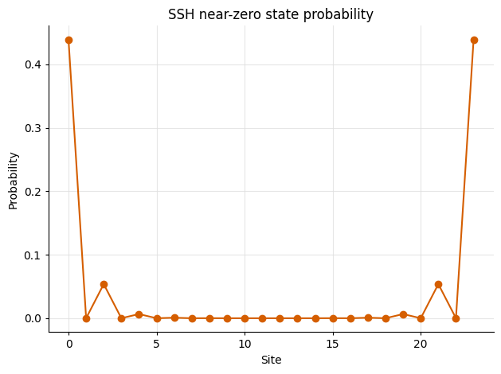

### 07. Boundary Conditions and Finite-Size Effects

- Notebook: `notebooks/07_boundary_conditions_and_finite_size.ipynb`
- [Rendered HTML](docs/notebooks/07_boundary_conditions_and_finite_size.html)
- Result: the open SSH chain has minimum $|E|=8.81\times10^{-5}$ and edge
  weight $0.9744$; periodic boundaries remove the near-zero edge mode.

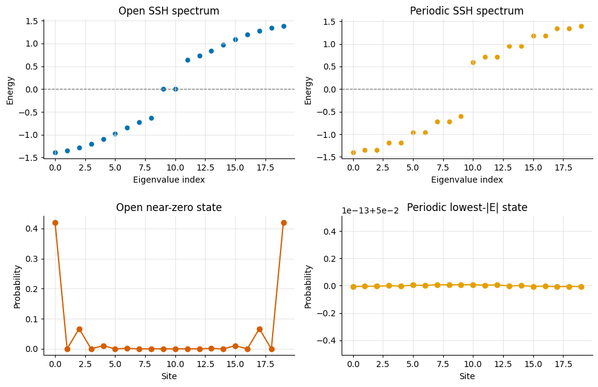

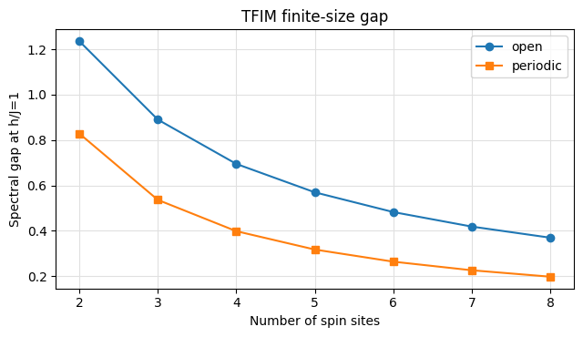

### 08. Aubry-André Localization

- Notebook: `notebooks/08_aubry_andre_localization.ipynb`
- [Rendered HTML](docs/notebooks/08_aubry_andre_localization.html)
- Result: mean eigenstate IPR rises from $0.026948$ at zero potential to
  $0.699123$ at $\lambda/t=4$.

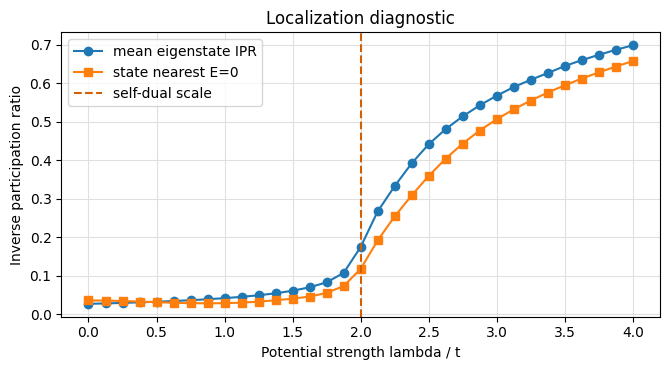

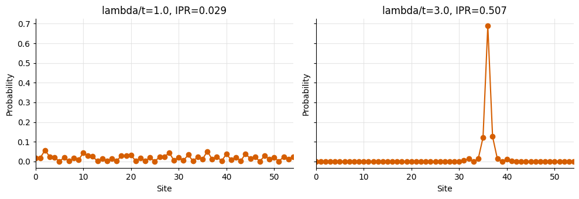

### 09. Kitaev BdG Symmetry

- Notebook: `notebooks/09_kitaev_bdg_symmetry.ipynb`
- [Rendered HTML](docs/notebooks/09_kitaev_bdg_symmetry.html)
- Result: verifies particle-hole pairing and tracks the BdG gap versus chemical potential.

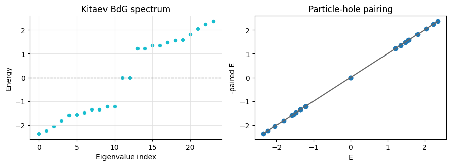

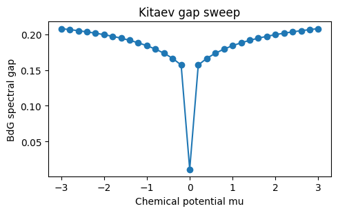

### 10. Hofstadter Flux Sweep

- Notebook: `notebooks/10_hofstadter_flux_sweep.ipynb`
- [Rendered HTML](docs/notebooks/10_hofstadter_flux_sweep.html)
- Result: connects a fixed-flux square-lattice graph to its finite-lattice flux spectrum.

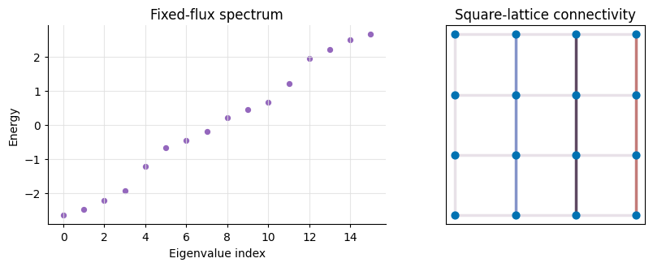

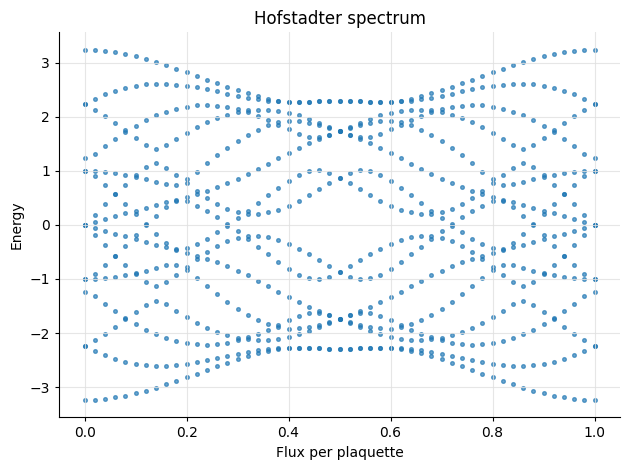

### 11. Haldane, Triangular, and Kagome Lattices

- Notebook: `notebooks/11_haldane_kagome_lattices.ipynb`
- [Rendered HTML](docs/notebooks/11_haldane_kagome_lattices.html)
- Result: compares finite spectra and connectivity for three non-square lattice families.

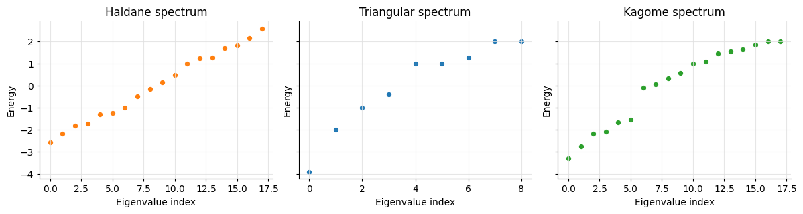

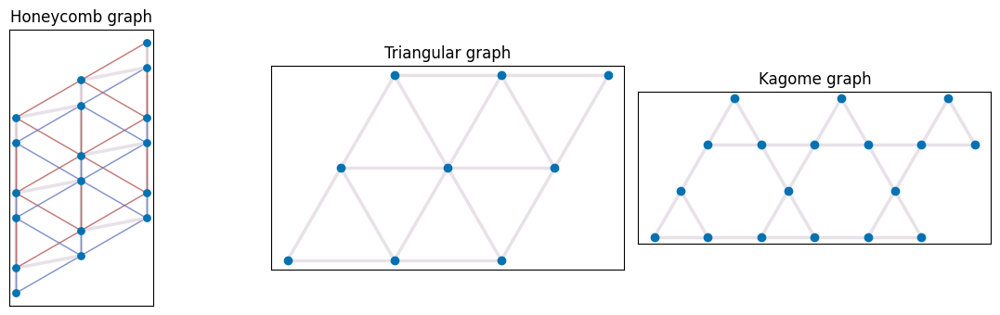

### 12. Custom Lattice Workflow

- Notebook: `notebooks/12_custom_lattice_workflow.ipynb`
- [Rendered HTML](docs/notebooks/12_custom_lattice_workflow.html)
- Result: a six-site complex-hopping lattice is Hermitian, its dense/sparse forms agree, and it can be registered temporarily.

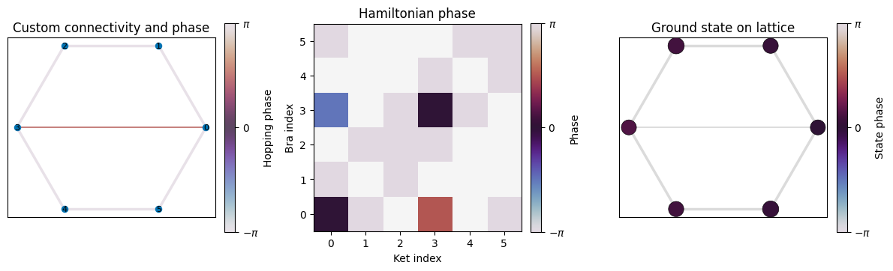

### 13. Hamiltonian Structure Gallery

- Notebook: `notebooks/13_hamiltonian_structure_gallery.ipynb`
- [Rendered HTML](docs/notebooks/13_hamiltonian_structure_gallery.html)
- Result: compares matrix locality and basis structure, then isolates complex Hofstadter/Haldane hopping phases.

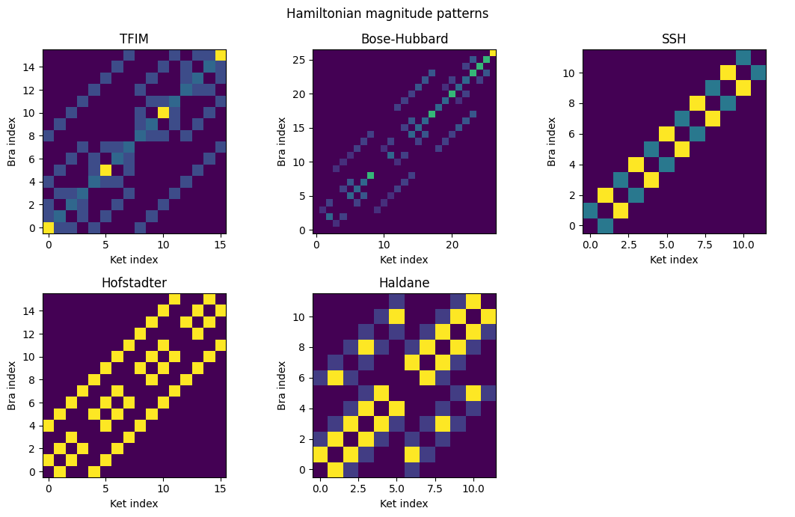

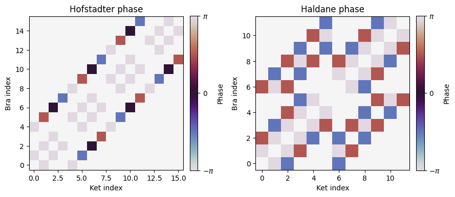

### 14. Sparse and Dense Scaling

- Notebook: `notebooks/14_sparse_dense_scaling.ipynb`
- [Rendered HTML](docs/notebooks/14_sparse_dense_scaling.html)
- Result: sparse density decreases with dimension; demonstrated dense/sparse storage ratios range from `3.98x` to `18.41x`.

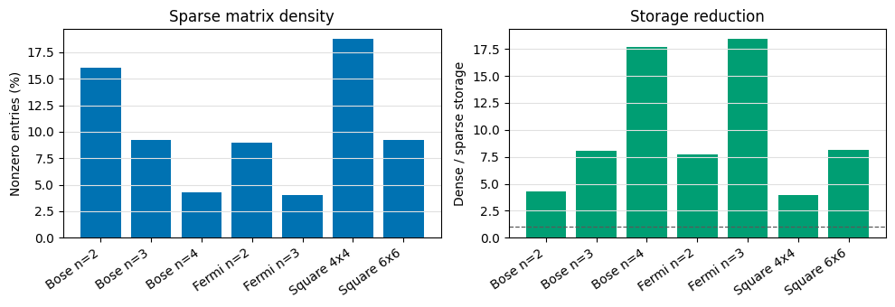

### 15. PennyLane Export

- Notebook: `notebooks/15_pennylane_export.ipynb`
- [Rendered HTML](docs/notebooks/15_pennylane_export.html)
- Result: five TFIM Pauli terms export to PennyLane with zero matrix-level difference.

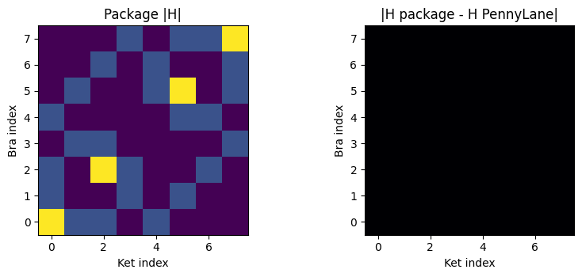

### 16. Model Registry and CLI

- Notebook: `notebooks/16_model_registry_and_cli.ipynb`
- [Rendered HTML](docs/notebooks/16_model_registry_and_cli.html)
- Result: prints registered model categories, dimensions, return types, and defaults.

### 17. CLI Plot Walkthrough

- Notebook: `notebooks/17_cli_plot_walkthrough.ipynb`
- [Rendered HTML](docs/notebooks/17_cli_plot_walkthrough.html)
- Result: demonstrates model listing, an SSH spectrum command, and reproducible Hofstadter PNG output.
