# Theory

This document gives short, working notes for the models and methods implemented
in the package. It is not a full textbook treatment.

## Transverse-Field Ising Model

The transverse-field Ising chain is a spin-$\tfrac{1}{2}$ model with
nearest-neighbor $ZZ$ interactions and a transverse $X$ field:

$$
H=-J\sum_{i=0}^{N-2} Z_iZ_{i+1}-h\sum_{i=0}^{N-1}X_i.
$$

Here, $H$ is the Hamiltonian, $N$ is the number of spin sites, $i$ is a
site index, $X_i$ and $Z_i$ are Pauli operators acting on site $i$, $J$
is the nearest-neighbor Ising coupling, and $h$ is the transverse-field
strength. The displayed limits describe open boundaries; periodic boundaries
also include the bond between sites $N-1$ and $0$.

The interaction favors aligned or anti-aligned computational-basis states
depending on the sign of $J$. The transverse field mixes
computational-basis states and drives quantum fluctuations. This makes the
model a standard testbed for exact diagonalization, phase-transition
intuition, VQE ansatz studies, and quantum simulation circuits.

The longitudinal-field variant is

$$
H=-J\sum_i Z_iZ_{i+1}-h_x\sum_iX_i-h_z\sum_iZ_i,
$$

where $h_x$ is the transverse-field strength and $h_z$ is the
longitudinal-field strength. A nonzero $h_z$ breaks the simple spin-flip
symmetry of the transverse-field model. The next-nearest-neighbor variant is

$$
H=-J_1\sum_i Z_iZ_{i+1}-J_2\sum_iZ_iZ_{i+2}-h\sum_iX_i,
$$

where $J_1$ and $J_2$ are the nearest- and next-nearest-neighbor Ising
couplings, respectively. Competing values of $J_1$ and $J_2$ provide a
small frustrated Ising testbed.

## Heisenberg Chain

The anisotropic Heisenberg chain includes $XX$, $YY$, and $ZZ$
couplings:

$$
H=\sum_i\left(
J_xX_iX_{i+1}+J_yY_iY_{i+1}+J_zZ_iZ_{i+1}
\right)+g\sum_iZ_i.
$$

Here, $Y_i$ is the Pauli $Y$ operator on site $i$;
$J_x$, $J_y$, and $J_z$ are the coupling strengths in the three spin
directions; and $g$ is the longitudinal field coefficient used by the
builder. The positive sign of the field term matches the package
implementation.

The choice $J_x=J_y=J_z$ gives the isotropic Heisenberg model. Unequal
couplings give anisotropic variants. The model is useful for testing
symmetry-aware methods, spin transport ideas, exact diagonalization, and
variational workflows.

## XY and XXZ Spin Chains

The XY chain keeps $XX$ and $YY$ couplings with anisotropy parameter
$\gamma$:

$$
H=-J\sum_i\left[
\frac{1+\gamma}{2}X_iX_{i+1}
+\frac{1-\gamma}{2}Y_iY_{i+1}
\right]-g\sum_iZ_i.
$$

Here, $J$ is the overall exchange scale, $\gamma$ controls the difference
between the $XX$ and $YY$ couplings, and $g$ is the transverse
$Z$-field strength. In particular, $\gamma=0$ gives equal $XX$ and
$YY$ couplings.

The XXZ chain is the $J_x=J_y$ specialization of the anisotropic Heisenberg
chain:

$$
H=J\sum_i\left(
X_iX_{i+1}+Y_iY_{i+1}+\Delta Z_iZ_{i+1}
\right)+g\sum_iZ_i.
$$

Here, $\Delta$ is the $ZZ$ anisotropy relative to the $XX$ and $YY$
terms. These models are useful for studying anisotropy, magnetization,
spectral gaps, and small spin-system benchmarks with exact references.

## J1-J2 Heisenberg Chain

The J1-J2 chain adds next-nearest-neighbor Heisenberg interactions:

$$
H=J_1\sum_i\mathbf{P}_i\cdot\mathbf{P}_{i+1}
+J_2\sum_i\mathbf{P}_i\cdot\mathbf{P}_{i+2}
+g\sum_iZ_i,
$$

where $\mathbf{P}_i=(X_i,Y_i,Z_i)$ is the vector of Pauli operators at site
$i$, $J_1$ is the nearest-neighbor exchange, $J_2$ is the
next-nearest-neighbor exchange, and $g$ is the longitudinal field
coefficient. For a pair of sites, $j$ denotes the second site index. The
package uses Pauli matrices directly, so

$$
\mathbf{P}_i\cdot\mathbf{P}_j=X_iX_j+Y_iY_j+Z_iZ_j.
$$

The model is a compact frustrated spin-chain testbed.

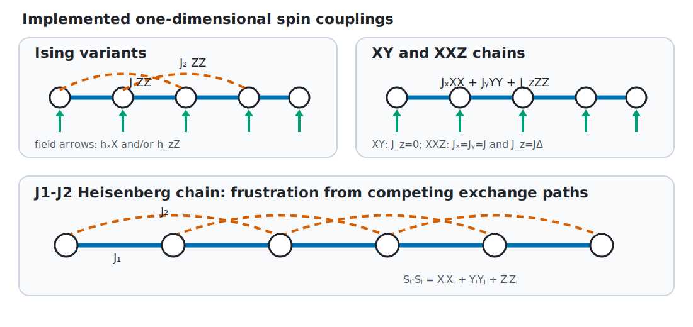

## Heisenberg Ladders

A two-leg Heisenberg ladder connects two spin chains with rung couplings:

$$
H=J_{\mathrm{leg}}\sum_{\ell=0}^{1}\sum_r
\mathbf{P}_{\ell,r}\cdot\mathbf{P}_{\ell,r+1}
+J_{\mathrm{rung}}\sum_r
\mathbf{P}_{0,r}\cdot\mathbf{P}_{1,r}
+g\sum_{\ell,r}Z_{\ell,r}.
$$

Here, $\ell\in\{0,1\}$ labels the two legs, $r$ labels a rung,
$\mathbf{P}_{\ell,r}$ is the Pauli-operator vector on that ladder site,
$J_{\mathrm{leg}}$ is the coupling along each leg,
$J_{\mathrm{rung}}$ is the coupling across each rung, and $g$ is the
longitudinal field coefficient. For $R$ rungs, the ladder contains $2R$
spins and has Hilbert-space dimension $2^{2R}$.

This geometry moves beyond strictly one-dimensional chains while remaining
small enough for exact diagonalization at low rung counts.

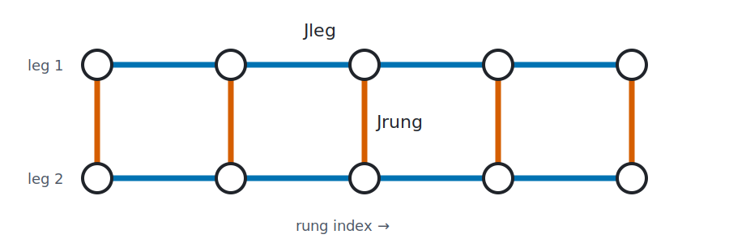

## Hubbard Models

The Bose-Hubbard model describes bosons hopping on a lattice with onsite
repulsion and chemical potential:

$$
H=-t\sum_{\langle i,j\rangle}
\left(a_i^\dagger a_j+a_j^\dagger a_i\right)
+\frac{U}{2}\sum_i n_i(n_i-1)-\mu\sum_i n_i.
$$

Here, $\langle i,j\rangle$ denotes a nearest-neighbor pair, $t$ is the
hopping amplitude, $a_i^\dagger$ and $a_i$ are bosonic creation and
annihilation operators at site $i$, $n_i=a_i^\dagger a_i$ is the local
occupation operator, $U$ is the onsite interaction strength, and $\mu$ is
the chemical potential.

The implementation truncates each local basis to
$\{|0\rangle,\ldots,|n_{\max}\rangle\}$, where $n_{\max}$ is the maximum
allowed occupation. For $N$ sites, the truncated basis dimension is
$(n_{\max}+1)^N$.

The spinful Fermi-Hubbard chain is implemented in an occupation-number basis
with explicit fermionic signs:

$$
H=-t\sum_{\langle i,j\rangle,\sigma}
\left(c_{i\sigma}^\dagger c_{j\sigma}
+c_{j\sigma}^\dagger c_{i\sigma}\right)
+U\sum_i n_{i\uparrow}n_{i\downarrow}
-\mu\sum_{i,\sigma}n_{i\sigma}.
$$

Here, $\sigma\in\{\uparrow,\downarrow\}$ labels spin,
$c_{i\sigma}^\dagger$ and $c_{i\sigma}$ are fermionic creation and
annihilation operators, and
$n_{i\sigma}=c_{i\sigma}^\dagger c_{i\sigma}$ is the corresponding
occupation operator. The parameters $t$, $U$, and $\mu$ have the same
roles as in the Bose-Hubbard model.

The orbital order is

$$
(0\uparrow,0\downarrow,1\uparrow,1\downarrow,\ldots).
$$

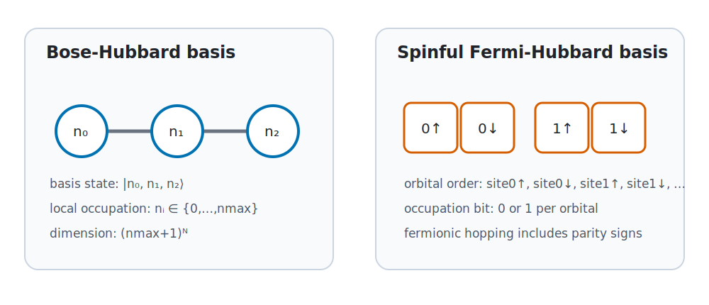

For a hop from orbital $p$ to orbital $q$, the implementation uses the
fermionic parity factor

$$
(-1)^{P_{pq}},
\qquad
P_{pq}=\sum_{\min(p,q)<k<\max(p,q)}n_k,
$$

where $p$ is the source-orbital index, $q$ is the destination-orbital
index, $k$ runs over orbitals strictly between them, and $n_k\in\{0,1\}$
is the occupation of orbital $k$. Crossing an odd number of occupied
orbitals therefore contributes a minus sign.

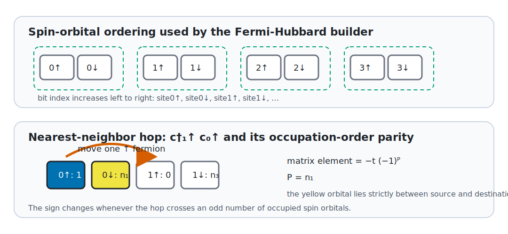

## Kitaev Chain

The Kitaev chain is a spinless p-wave superconducting chain:

$$
H=-t\sum_i\left(c_i^\dagger c_{i+1}+c_{i+1}^\dagger c_i\right)
-\mu\sum_i c_i^\dagger c_i
+\sum_i\left(\Delta c_i c_{i+1}
+\Delta^*c_{i+1}^\dagger c_i^\dagger\right).
$$

Here, $c_i^\dagger$ and $c_i$ create and annihilate a spinless fermion at
site $i$, $t$ is the hopping amplitude, $\mu$ is the chemical potential,
$\Delta$ is the generally complex nearest-neighbor pairing amplitude, and
$\Delta^*$ is its complex conjugate.

The package returns the Bogoliubov-de Gennes matrix

$$
\mathcal{H}_{\mathrm{BdG}}=
\begin{pmatrix}
A & D\\
-D^* & -A^*
\end{pmatrix}
$$

in the Nambu basis
$\Psi=(c_0,\ldots,c_{N-1},c_0^\dagger,\ldots,c_{N-1}^\dagger)^T$.
Here, $\Psi$ is the $2N$-component Nambu spinor, $A$ is the
$N\times N$ normal hopping matrix, $D$ is the antisymmetric
$N\times N$ pairing matrix, the star denotes complex conjugation, and
$T$ denotes transpose. Thus
$\mathcal{H}_{\mathrm{BdG}}$ has dimension $2N$; it is not a
$2^N$-dimensional many-body occupation-basis Hamiltonian.

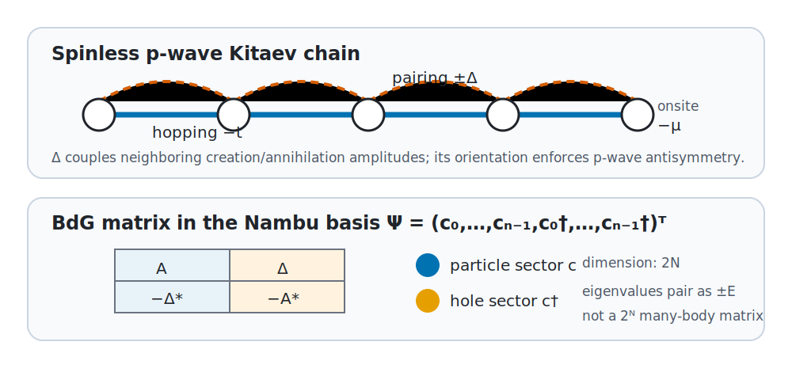

## SSH Model

The Su-Schrieffer-Heeger model is a one-dimensional tight-binding model with
two sites, $A$ and $B$, per unit cell:

$$
H=-\sum_{m=0}^{N_c-1}
\left(t_1|m,A\rangle\langle m,B|+\mathrm{h.c.}\right)
-\sum_{m=0}^{N_c-2}
\left(t_2|m+1,A\rangle\langle m,B|+\mathrm{h.c.}\right).
$$

Here, $m$ is the unit-cell index, $N_c$ is the number of unit cells,
$|m,A\rangle$ and $|m,B\rangle$ are single-particle site states,
$t_1$ is the intracell hopping amplitude, $t_2$ is the intercell hopping
amplitude, and $\mathrm{h.c.}$ denotes the Hermitian-conjugate term.

For open boundaries and $t_1<t_2$, the finite chain supports
near-zero-energy states localized near the two ends. The SSH Hamiltonian is a
single-particle matrix of dimension $2N_c$, not a many-body qubit
Hamiltonian.

The Rice-Mele model uses alternating hoppings

$$
t_{\mathrm{intra}}=t+\delta,
\qquad
t_{\mathrm{inter}}=t-\delta,
$$

and staggered onsite energies $+\Delta_{\mathrm{RM}}$ on sublattice $A$
and $-\Delta_{\mathrm{RM}}$ on sublattice $B$. Here, $t$ is the mean
hopping, $\delta$ is the hopping dimerization, and
$\Delta_{\mathrm{RM}}$ is the onsite staggering. This extends SSH with
inversion-symmetry breaking.

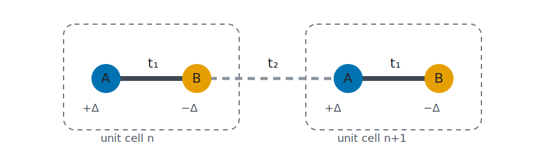

Open boundaries leave physical ends at which topological SSH modes can
localize. Periodic boundaries add the intercell bond from the final $B$ site
to the first $A$ site, eliminating those ends and their isolated edge modes.

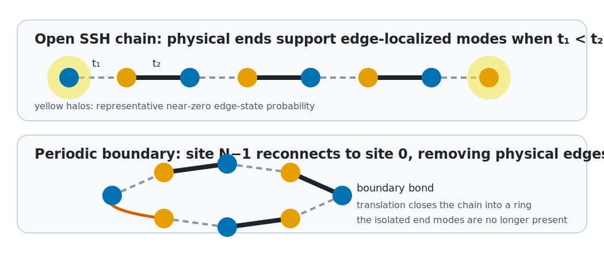

## Tight-Binding Hamiltonians

A generic one-dimensional single-particle tight-binding Hamiltonian is

$$
H=-t\sum_{\langle i,j\rangle}
\left(|i\rangle\langle j|+|j\rangle\langle i|\right)
+\sum_i\epsilon_i|i\rangle\langle i|.
$$

Here, $|i\rangle$ is the state localized at site $i$, $t$ is the
nearest-neighbor hopping amplitude, and $\epsilon_i$ is the onsite energy.
The matrix diagonal contains the $\epsilon_i$, while its off-diagonal
entries contain hopping amplitudes.

The square-lattice builder extends this model to an
$N_r\times N_c$ rectangular lattice, where $N_r$ and $N_c$ are the
numbers of rows and columns. Sites use row-major ordering. Independent
periodic-boundary flags can reconnect opposite edges in the horizontal and
vertical directions.

The Harper-Hofstadter square-lattice builder adds magnetic Peierls phases in
Landau gauge. A vertical hopping in column $x$ carries the phase factor

$$
\exp(2\pi i f x),
$$

where $i=\sqrt{-1}$ is the imaginary unit, $f$ is the magnetic flux per
plaquette in units of the flux quantum, and $x$ is the zero-based column
index. Horizontal hoppings remain real. The accumulated phase around one
plaquette is $2\pi f$.

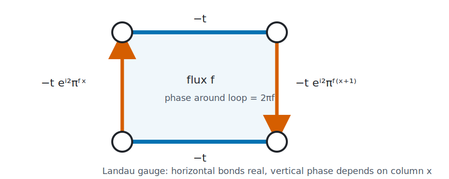

The Aubry-Andre-Harper chain adds the quasiperiodic onsite potential

$$
V_i=\lambda\cos(2\pi\beta i+\phi).
$$

Here, $V_i$ is the onsite potential at site $i$, $\lambda$ is its
amplitude, $\beta$ is the modulation frequency relative to the lattice, and
$\phi$ is a phase offset. An irrational $\beta$ produces a quasiperiodic
rather than periodic modulation. The model is useful for localization studies
and for testing spectral algorithms on structured but nonuniform
single-particle Hamiltonians.

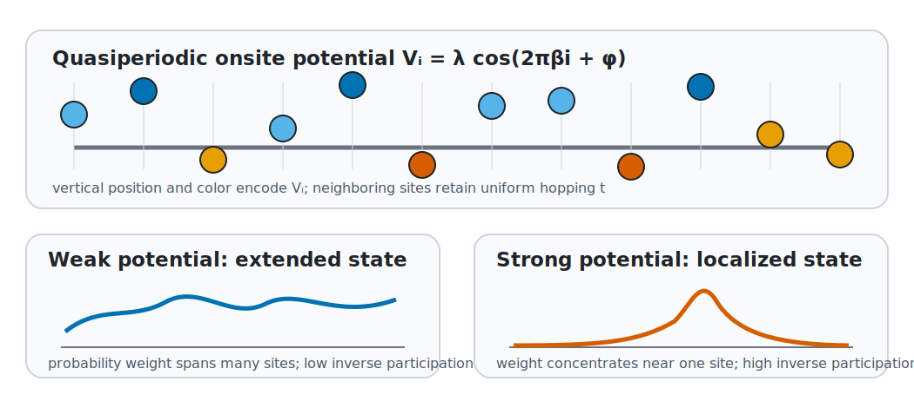

The Haldane honeycomb-lattice builder uses real nearest-neighbor hopping
$t_1$, complex next-nearest-neighbor hopping $t_2e^{\pm i\phi_H}$, and
onsite energies $+M$ and $-M$ on the two sublattices. Here, $t_1$ is the
nearest-neighbor hopping magnitude, $t_2$ is the next-nearest-neighbor
hopping magnitude, $\phi_H$ is the oriented hopping phase, and $M$ is the
sublattice potential. The triangular and kagome builders provide additional
non-square single-particle geometries useful for flat-band and
frustrated-lattice examples.

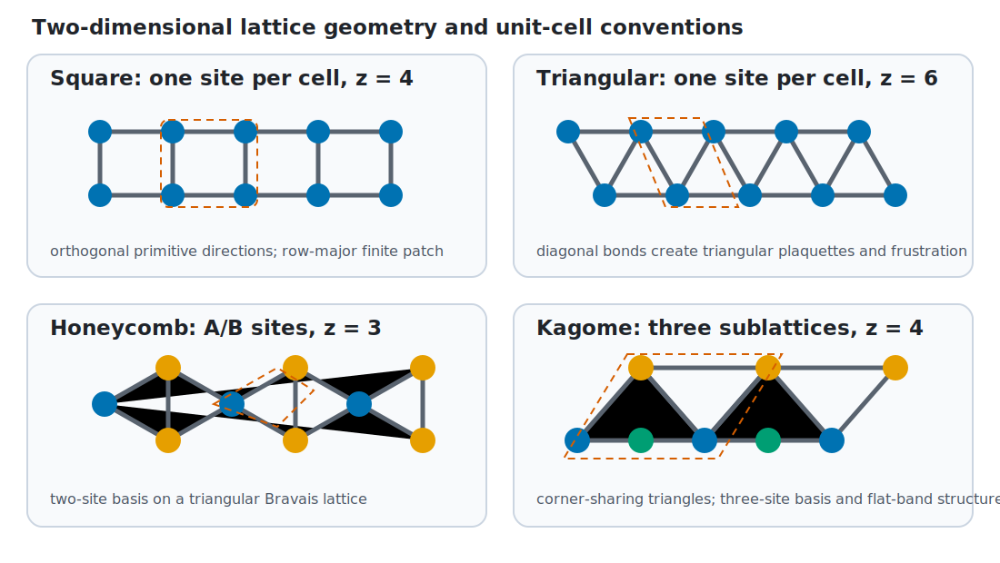

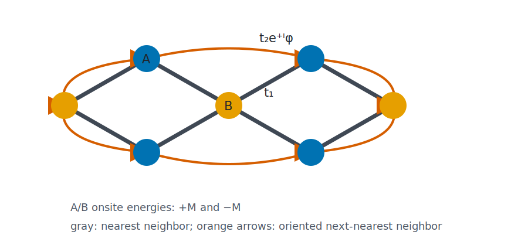

These matrices are easy to inspect, diagonalize, and plot while still
representing real lattice physics.

## Exact Diagonalization

Exact diagonalization constructs a matrix representation of $H$ and solves

$$
H|\psi_n\rangle=E_n|\psi_n\rangle,
$$

where $|\psi_n\rangle$ is the $n$-th eigenstate and $E_n$ is its
eigenvalue. This gives direct access to spectra, ground states, gaps,
observables, and eigenstate structure.

For a chain of $N$ spin-$\tfrac{1}{2}$ sites, the Hilbert-space dimension
is

$$
d=2^N,
$$

where $d$ is the matrix dimension. Dense exact diagonalization is therefore
appropriate only for small spin systems.

Sparse builders and sparse eigensolvers reduce memory pressure for selected
tight-binding and Hubbard workflows. They do not change the exponential basis
scaling of many-body Hubbard models.

## Quantum Algorithm Testbeds

These models are useful for quantum algorithm work because they are structured
but still small enough to verify classically.

- VQE prepares parameterized states and compares variational energies against
  exact ground energies.
- QPE uses known spectra to test phase-estimation workflows.
- QSVT studies polynomial transformations of Hamiltonian spectra on controlled
  examples.
- Quantum walks use tight-binding matrices as graph or lattice walk generators.
- Quantum simulation compares Trotterized or block-encoded dynamics against
  exact dense evolution.

The honest role of this package is to provide small, transparent reference
problems. It does not claim speedups by itself.
